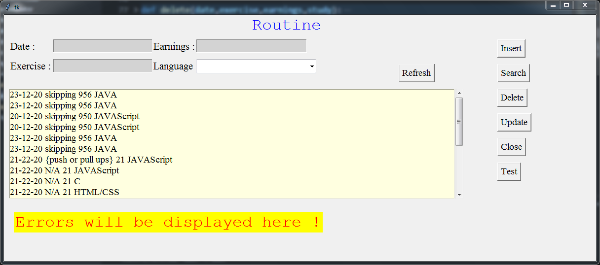

# <u>Routine Manager</u>

Hey Guys I have used postgresql for database connection . 
Following are the **libraries** that were used :
1. psycopg2
2. tkinter
3. functools
   - partial
4. datetime

- Youtube -> [yt][youtube]
- Github -> [gh][github]
- Github Site -> [s1][site]
- Personal Site -> [s2][site2]
  
[youtube]:www.youtube.com
[github]:github.com/Sahil1709
[site]:sahil1709.github.io
[site2]:sahilgupta.tk

